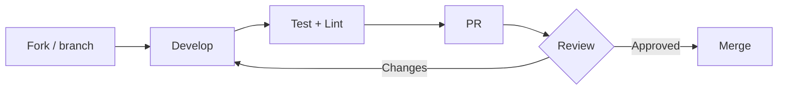

<!-- SPDX-License-Identifier: CC-BY-SA-4.0 -->
<!-- Copyright (c) 2026 Netresearch DTT GmbH -->

# Contributing to glpi-docker-compose-stack

Thanks for your interest in contributing! This repository packages
[GLPI](https://glpi-project.org/) as a hardened, self-contained Docker Compose
stack: a single-purpose `glpi-php-fpm` image plus the surrounding services
(MariaDB, Valkey, nginx, the ofelia scheduler and the phpbu backup job).

## Development Setup

### Prerequisites

- Docker with the Buildx and Compose plugins
- Git
- (optional) [`pre-commit`](https://pre-commit.com/) for local lint hooks

### Quick start

```bash
git clone https://github.com/netresearch/glpi-docker-compose-stack.git
cd glpi-docker-compose-stack

make init     # bootstrap .env (random DB passwords, idempotent)
make up       # start the stack (detached)
make health   # aggregated health of every service
make logs     # tail logs
make down     # stop (volumes preserved)
```

`make help` lists every target.

### Building the image

```bash
# Local single-arch image (glpi-php-fpm:local) via the Makefile
make build

# …or via the bake file directly (glpi-php-fpm:dev, host arch, loaded)
docker buildx bake dev

docker run --rm glpi-php-fpm:dev php -v
```

The released multi-arch image is produced from the same
[`docker-bake.hcl`](docker-bake.hcl) `glpi` target (see *Release Process*).

## Making Changes

### Branch naming

- `feat/` — new features
- `fix/` — bug fixes
- `docs/` — documentation
- `security/` — security improvements
- `chore/` — tooling / maintenance

### Commit messages

Follow [Conventional Commits](https://www.conventionalcommits.org/):

```
type(scope): short description

[optional body]

[optional footer]
```

Types: `feat`, `fix`, `docs`, `style`, `refactor`, `test`, `chore`, `ci`.

Examples:

```
feat(compose): add Caddy reverse-proxy overlay
fix(entrypoint): repair volume ownership before privilege drop
docs(readme): document GLPI_HTTP_PORT loopback default
```

## Testing

Run the same checks CI runs, locally:

```bash
# Lint everything (hadolint + shellcheck + yamllint, no local installs)
make lint
# …or, if you use pre-commit:
pre-commit run --all-files

# Validate the bake file resolves
docker buildx bake --print

# Image-surface check (container-structure-test)
make test-image

# GLPI's own phpunit suite (slow, builds the tester stage)
make test-glpi

# Regression suite for the bin/ helper scripts
make test-bats

# Validate the Compose configuration
docker compose config --quiet

# Overlay hardening (run when you touch examples/*.yml)
./tests/lint/hardening-check.sh
```

## Pull Request Process



1. **Fork** the repository (or branch, if you have access).
2. **Create** a topic branch from `main`.
3. **Make** your changes.
4. **Test + lint** with the commands above.
5. **Open** a pull request and fill in the template.

### PR checklist

- [ ] `make lint` (hadolint, shellcheck, yamllint) and actionlint are clean
- [ ] `docker buildx bake --print` validates the bake file
- [ ] The image builds (`make build`)
- [ ] `make test-bats` passes
- [ ] `make test-image` passes
- [ ] `docker compose config` validates
- [ ] `./tests/lint/hardening-check.sh` passes (if `examples/` changed)
- [ ] No new critical/high vulnerabilities (Trivy)
- [ ] Documentation updated if behavior changed

## Release Process

Releases are automated. Tags use **bare semver, no `v` prefix** (matching the
bundled GLPI version):

```bash
git tag -s 11.0.8 -m "11.0.8"   # signed tag
git push origin 11.0.8
```

[`release.yml`](.github/workflows/release.yml) then builds the multi-arch
image via `docker-bake.hcl`, pushes `<version>` / `<major.minor>` / `<major>` /
`latest`, cosign-signs each tag, and publishes a GitHub Release with
categorized notes.

## Code Style

- **Dockerfile** — multi-stage, minimal layers, non-root, OCI labels; follow
  hadolint (`.hadolint.yaml`).
- **HCL / YAML** — 2-space indentation (`.editorconfig`); keep `docker-bake.hcl`
  targets grouped and documented.
- **Shell** — `set -euo pipefail`; keep it shellcheck-clean.
- **GitHub Actions** — pin third-party actions by commit SHA with a trailing
  `# vX.Y.Z` comment; reference `netresearch/.github` reusable workflows at
  `@main` (never SHA-pinned).

## Getting Help

- **Issues**: <https://github.com/netresearch/glpi-docker-compose-stack/issues>
- **Security**: <https://github.com/netresearch/glpi-docker-compose-stack/security/advisories/new>

## License

By contributing, you agree that your contributions are licensed under this
repository's split licensing: **MIT** for code and code-shaped configuration,
**CC-BY-SA-4.0** for prose and documentation. See
[LICENSE-MIT](LICENSE-MIT) and [LICENSE-CC-BY-SA-4.0](LICENSE-CC-BY-SA-4.0).
