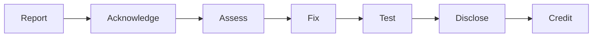

<!-- SPDX-License-Identifier: CC-BY-SA-4.0 -->
<!-- Copyright (c) 2026 Netresearch DTT GmbH -->

# Security Policy

## Scope

This policy covers the **Docker packaging and orchestration** in this
repository — the `glpi-php-fpm` image (`Dockerfile`, `rootfs/`), the Compose
stack (`compose.yml`, `examples/` overlays), the runtime configuration
(`config/`) and the CI/CD that builds and publishes them.

Vulnerabilities in **GLPI itself** (the application bundled into the image)
belong upstream — report them to the
[GLPI project security advisories](https://github.com/glpi-project/glpi/security/advisories).

## Reporting a Vulnerability

We take security seriously. If you find an issue in the container packaging or
the Compose stack, please report it responsibly.

### How to Report

1. **Do NOT** open a public GitHub issue for a security vulnerability.
2. Report privately via
   [GitHub Security Advisories](https://github.com/netresearch/glpi-docker-compose-stack/security/advisories/new).
3. Include as much detail as you can:
   - Description of the vulnerability
   - Steps to reproduce
   - Potential impact
   - A suggested fix, if you have one

### What to Expect



1. Acknowledgement of your report
2. Assessment of severity and impact
3. Development and testing of a fix
4. Coordinated disclosure
5. Credit in the release notes (if you wish)

## Security Measures

### Image hardening
- **Non-root execution** — php-fpm runs as `www-data`; the entrypoint drops
  privileges with `su-exec` after repairing volume ownership.
- **Read-only application code** — GLPI's source, `vendor/` and `public/` are
  owned by `root` and only *readable* by `www-data`. A compromised worker
  cannot rewrite application code at runtime.
- **Minimal multi-stage Alpine build** — build toolchain (`-dev` packages,
  `$PHPIZE_DEPS`) is dropped from the runtime layer; only the shared libraries
  the extensions link against remain.
- **Bundled-tarball integrity pin** — the GLPI release tarball is verified
  against a pinned `GLPI_SHA256` at build time (resolved per-release in CI), so
  a swapped upstream asset cannot slip into a signed image.
- **PHP hardening** — `expose_php=Off`, `display_errors=Off`,
  `session.cookie_httponly`, `session.cookie_samesite=Lax`,
  `session.use_strict_mode=1`, OPcache with `validate_timestamps=0` over the
  immutable code layer. `disable_functions` is intentionally left unset: GLPI
  legitimately shells out (LDAP tooling, PDF generation, marketplace installs,
  scheduled `bin/console` tasks), so defence-in-depth comes from the non-root
  user, the read-only code layer and container isolation rather than a
  function blocklist.
- **Unix-socket-only php-fpm** — no TCP listener on port 9000, so a sibling
  container cannot bypass nginx and speak FastCGI directly to the app.
- **HEALTHCHECK + graceful shutdown** — php-fpm `/ping` probe over the socket;
  `STOPSIGNAL SIGQUIT` drains in-flight requests instead of killing them.

### Stack hardening (Compose)
- **`no-new-privileges:true`** on every long-running service (including the
  opt-in `examples/` overlays).
- **`cap_drop: ALL`** on the application and web containers, with only the
  minimal capabilities re-added.
- **Read-only mounts** — nginx reads the published assets read-only.
- **Loopback-bound web port** by default (`GLPI_HTTP_PORT` on `127.0.0.1`);
  put a TLS-terminating reverse proxy (Traefik/Caddy overlays) in front for
  public exposure.
- **Crypt key handling** — `glpicrypt.key` lives in the `glpi-config` volume
  and is **never regenerated** (regeneration makes existing encrypted secrets
  undecryptable). The backup job archives the config directory so the key is
  recoverable.

### Supply-chain security
- **Signed images** — keyless Cosign (OIDC) signatures on every released tag.
- **SBOM** — an SPDX SBOM is attached to each image.
- **SLSA build provenance** — attested via GitHub's attestation store
  (`gh attestation verify`).
- **Daily CVE scanning** — Trivy scans the published images and osv-scanner
  scans the baked `composer.lock` on a daily schedule.
- **Automated updates** — Renovate (base images, PHP packages, GLPI version
  pin) with Dependabot covering GitHub Actions as a fallback.
- **Daily rebuild** — the floating tags are rebuilt nightly so base-image
  (Alpine / PHP) CVE fixes land without waiting for a new GLPI release.

## Verifying a Released Image

```bash
# Verify the keyless signature
cosign verify ghcr.io/netresearch/glpi-php-fpm:latest \
  --certificate-identity-regexp "https://github.com/netresearch/glpi-docker-compose-stack" \
  --certificate-oidc-issuer "https://token.actions.githubusercontent.com"

# Verify SLSA build provenance
gh attestation verify oci://ghcr.io/netresearch/glpi-php-fpm:latest \
  --repo netresearch/glpi-docker-compose-stack

# Download the SBOM
cosign download sbom ghcr.io/netresearch/glpi-php-fpm:latest > sbom.spdx.json
```

## Security Contact

Report vulnerabilities via
[GitHub Security Advisories](https://github.com/netresearch/glpi-docker-compose-stack/security/advisories/new).
For organization-wide disclosure process, see the
[Netresearch org security policy](https://github.com/netresearch/.github/blob/main/SECURITY.md).
